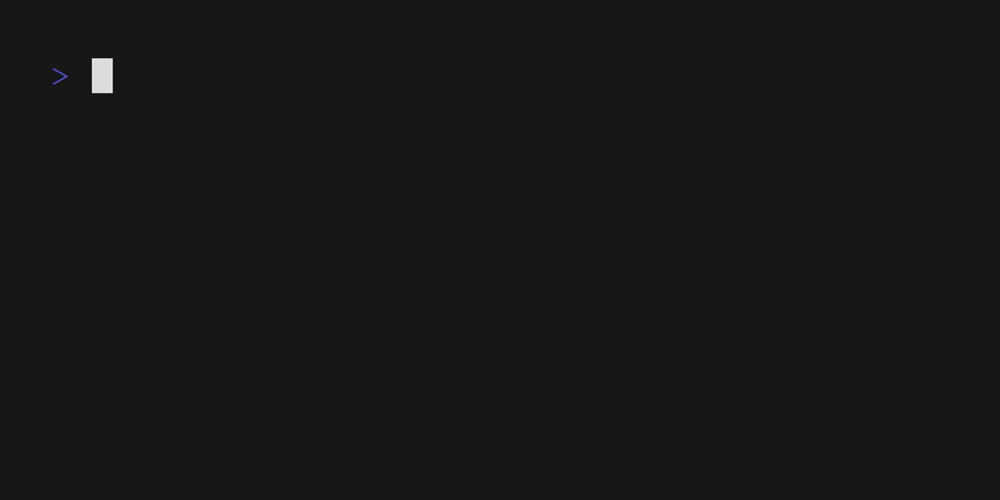

# Mookie Launcher

A simple cli menu tool to launch a set of predefined commands.



Mookie launcher allows you to specify a menu structure in JSON format and execute the selected command. It can be useful for quickly launching hard to remember oneliners, bash scripts, programs, etc.

## Installation

### With AUR:

```bash
yay -S mkl-bin
```

With Go:

```bash
go install github.com/make0x20/mkl@latest
```

## Create a menu

Create a menu.json inside `~/config/mookie-launcher` (or pass a sustom path using `-m /path/to/menu.json`). Example menu:

```json
{
  "System monitor": "htop",
  "Code editor": "nvim",
  "Calendar": "cal -3",
  "Git": {
  "Log - pretty": "git log --graph --abbrev-commit --decorate --format=format:'%C(bold blue)%h%C(reset) - %C(bold green)(%ar)%C(reset) %C(white)%s%C(reset) %C(dim white)- %an%C(reset)%C(auto)%d%C(reset)' --all",
  "Log - oneline": "git log --oneline"
  },
  "System": {
  "Update (Arch)": "sudo pacman -Syu",
    "Disk usage": "df -h",
    "Free memory": "free -h",
    "Kernel version": "uname -r"
    },
  "Security": {
    "Generate password": "head -c 32 /dev/random | base64 | tr -dc 'a-zA-Z0-9'",
    "Check ports": "sudo netstat -tulnp",
    "External IP": "curl ifconfig.me"
  }
}

```

## Theming

You can customize the colors of the menu by creating a `theme.json` file inside `~/config/mookie-launcher` (or pass a custom path using `-t /path/to/theme.json`). Example theme with all possible parameters:

```json

{
  "base_foreground": "#FFFFFF",
  "base_background": "",
  "base_bold": false,

  "title_foreground": "#FF0053",
  "title_background": "",
  "title_bold": true,
  "title_separator": "double",

  "option_foreground": "#00BDED",
  "option_background": "",
  "option_bold": false,

  "selected_foreground": "#00BDED",
  "selected_background": "#000000",
  "selected_bold": true,

  "selector_foreground": "#000000",
  "selector_background": "#FF0053",
  "selector_bold": true,
  "selector_string": "❯ ",

  "submenu_pointer": " ❯"
}

```

## Usage

```bash
# simple usage - will look for menu.json and theme.json inside ~/config/mookie-launcher
mkl

# specify a menu file
mkl -m <path to menu JSON file>

# set custom menu name
mkl -n <menu name>

# print the selected command to stdout instead of executing it - useful for piping to other commands
mkl -p

# specify a theme file
mkl -t <path to theme JSON file>
```

Search through entries using / - courtesy of [huh](https://github.com/charmbracelet/huh).

